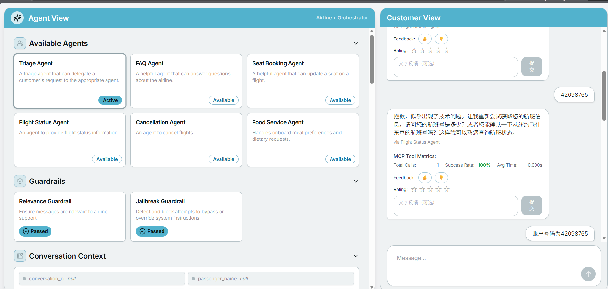
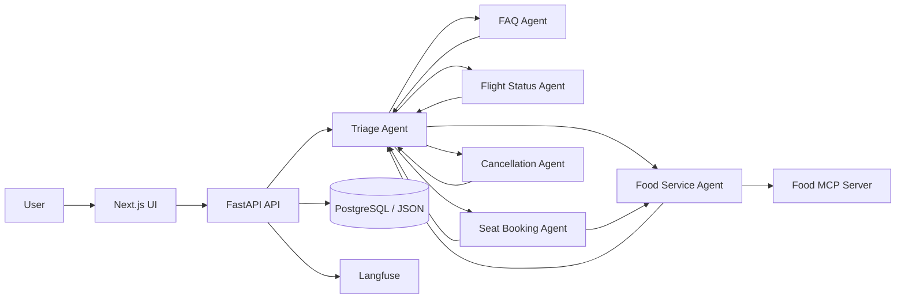
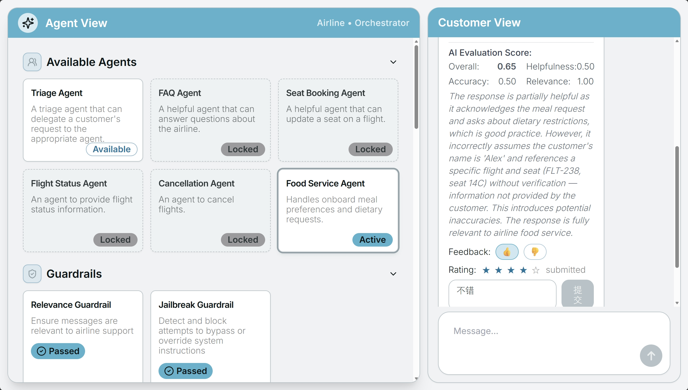
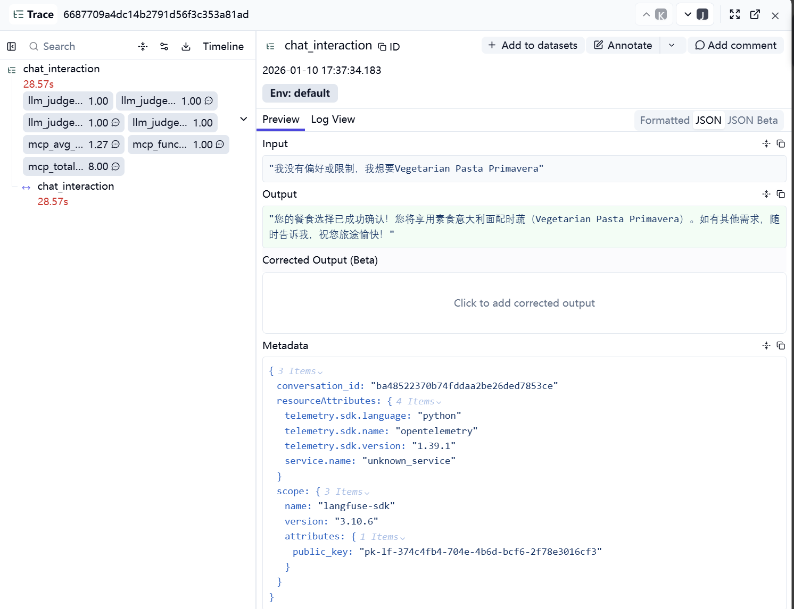
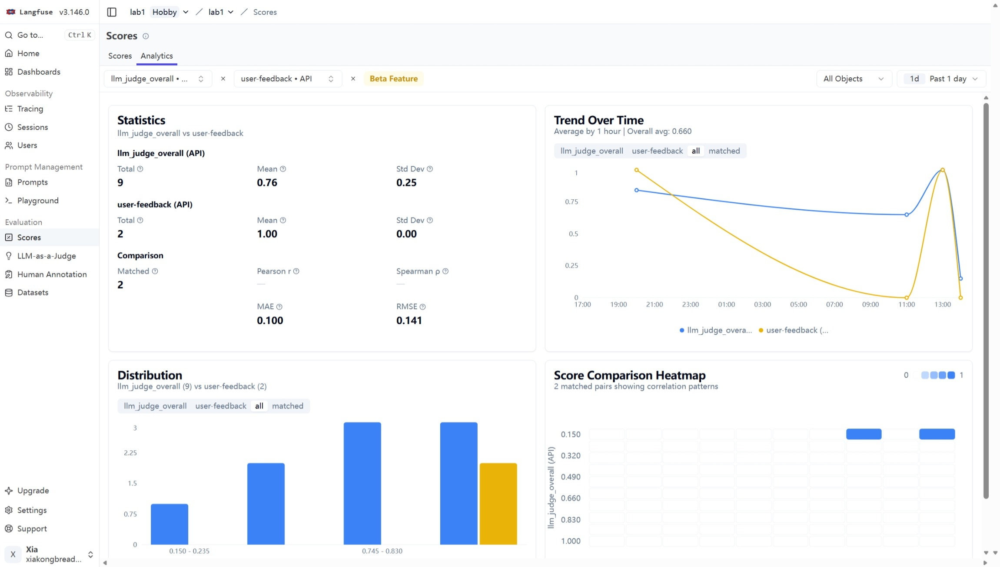
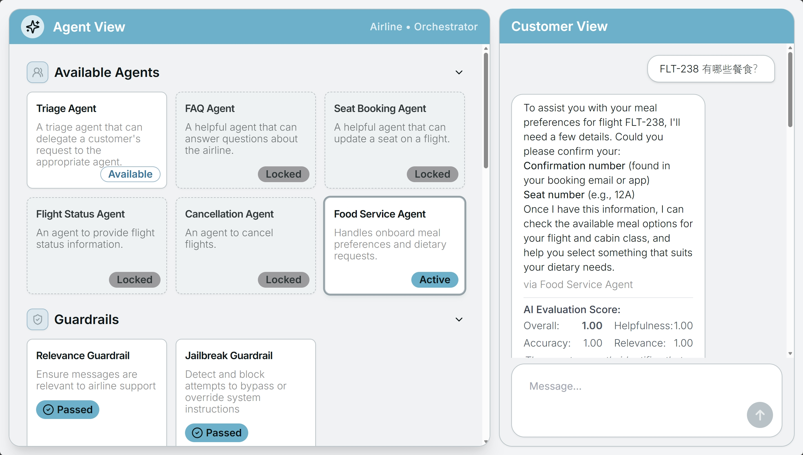

<div align="center">

# AgentOps Desk

**面向航空客服场景的多智能体 AgentOps 工程实践**

基于 OpenAI Agents SDK，围绕航空客服场景构建了一套具备**多 Agent 编排、状态持久化、用户反馈闭环、观测评估、MCP 扩展**能力的完整系统。

<p>
  
  
  
  
  
  
  
</p>

<p><em>Multi-Agent Orchestration · Persistent Memory · Human-in-the-Loop Feedback · Evaluation · MCP</em></p>

</div>

<div align="center">
  
  <br>
  <sub>Next.js 前端统一展示 Agent、对话消息、Guardrails、Runner Output 与评分入口</sub>
</div>

## 项目定位

`AgentOps Desk` 以航空客服场景为载体，目标不是停留在“模型能回答问题”的 demo 层，而是补齐真实 Agent 系统更关键的工程环节：

- 多 Agent 路由与 Handoff，而不是单轮问答
- 会话状态持久化，而不是页面刷新即丢失
- 用户反馈、自动评估、工具调用指标统一沉淀，而不是只看主观效果
- Food Service 能力解耦成独立 MCP Server，而不是全部写死在主流程里
- FastAPI + Next.js 单端口交付，而不是仅保留原型界面

从项目表达上，它更接近一个**围绕多智能体工作流、状态管理、可观测性和评估闭环展开的 Agent 工程项目**，而不只是一个简单原型。

## 我们实际解决了什么问题

传统 demo 往往只能证明“模型可以调用工具”，但很难回答下面几个工程问题：

- 多个 Agent 如何稳定协作，而不是互相抢答或上下文断裂？
- 会话状态如何在多轮对话、服务重启之后继续可用？
- 用户反馈如何绑定到具体一轮交互，而不是停留在界面层？
- Agent 回答变好了还是变差了，如何用指标而不是感觉判断？
- 新增一个业务 Agent 后，如何验证没有破坏原有流程？

这个仓库的核心工作，就是把上面这些问题都补成可运行、可追踪、可验证的实现。

## 核心亮点

### 1. 多智能体编排

- 设计 `Triage Agent` 作为统一入口，负责将请求路由到 FAQ、航班查询、座位调整、取消退款、餐食服务等专用 Agent。
- 通过 Handoff 机制让业务 Agent 之间可以回流和串联，例如 `Seat Booking Agent -> Food Service Agent`。
- 同时保留 Guardrails，避免无关请求或越权请求直接进入业务流程。

### 2. 会话状态与长期存储

- 抽象 `ConversationStore`，支持 `JSON`、`PostgreSQL JSONB`、`CompositeConversationStore` 三种实现。
- 在 PostgreSQL 可用时执行双写；数据库不可用时自动降级到本地 JSON，保证系统仍可运行。
- 会话上下文中保存 `conversation_id`、`trace_history`、`feedback`、航班/座位/餐食状态等信息，支持重启恢复。

### 3. 用户反馈闭环

- 对每条 assistant 消息提供 Like / Dislike、1-5 星评分、文字评论。
- 用 `trace_id` 贯通前端消息、后端日志、Langfuse Score，形成完整反馈链路。
- Langfuse 不可用时仍会写入 `feedback.jsonl`，保证实验数据不丢。

### 4. 可观测性与自动评估

- 用 Langfuse 记录 Trace、Score 和 Analytics，补齐 Agent 工作流的可观测性。
- 后端异步执行 `LLM-as-a-Judge`，自动评估 `helpfulness / accuracy / relevance / overall_score`。
- 通过 `FunctionCallTracker` 记录工具调用次数、成功率、平均耗时，并回显到前端。

### 5. MCP 业务扩展

- 将 Food Service 能力拆成独立 `FastMCP` 服务，支持菜单查询、用户画像读取、偏好记录、下单确认。
- 主系统可通过 `USE_FOOD_MCP=true/false` 在 MCP 工具与本地工具之间切换。
- 进一步基于 Langfuse Dataset/Experiment 做 trajectory 评估，验证工具调用序列是否符合预期。

## 系统架构



### 关键链路

1. `POST /api/chat`
   生成 `trace_id`，执行 Agent workflow，返回消息、事件、上下文、Guardrails、MCP 指标。

2. `POST /api/feedback`
   将用户对单条 assistant 消息的评分与评论绑定到 `trace_id`，同时写入本地日志和 Langfuse。

3. `GET /api/history/{conversation_id}`
   用于恢复会话历史，并把异步生成的评估结果补回到前端消息。

## 可量化结果

以下指标来自项目中的对比实验和复现实验，用来证明系统不仅“能跑”，而且“能评估、能优化”。

### Food Agent Prompt 优化前后

| 指标 | Baseline | Optimized | 变化 |
| --- | ---: | ---: | ---: |
| `llm_judge_overall` | 0.72 | 0.89 | +23.6% |
| `llm_judge_accuracy` | 0.75 | 0.92 | +22.7% |
| `mcp_function_call_success_rate` | 68.5% | 95.2% | +38.9% |
| `mcp_total_function_calls` | 4.2 | 3.1 | -26.2% |
| `mcp_avg_execution_time` | 1.45s | 1.12s | -22.7% |

### Food MCP Trajectory 评估

| 指标 | 结果 |
| --- | --- |
| 数据集用例数 | 59 |
| trajectory exact match | 100% |
| 覆盖路径 | 菜单查询、账号下单确认、过敏咨询 |

这些结果对应的意义很直接：优化后的 Agent 在**回复质量、工具调用稳定性、执行效率**三个维度都有明显提升。

## 展示截图

### 1. 用户反馈入口

<div align="center">
  
</div>

每条 assistant 消息都可以直接提交 Like / Dislike、星级评分和文字反馈，便于把用户主观评价绑定到具体 `trace_id`。

### 2. Langfuse Trace 与评分

<div align="center">
  
</div>

Trace 页面聚合了用户输入、Agent 执行、Score 打分与工具调用指标，是后续分析和迭代的核心观测入口。

### 3. Score Analytics Dashboard

<div align="center">
  
</div>

Analytics 面板适合直接展示优化前后的指标变化，可以把用户反馈、LLM Judge 分数和工具调用指标放到同一套分析视角下对比。

### 4. Food Agent 业务场景

<div align="center">
  
</div>

Food Agent 支持菜单查询、缺参澄清、偏好记录与下单确认，是项目里最完整的一条业务闭环。

## 技术栈

| 层级 | 技术 |
| --- | --- |
| Agent Orchestration | OpenAI Agents SDK |
| Backend | FastAPI, Uvicorn, Pydantic |
| Frontend | Next.js, React, Tailwind CSS, TypeScript |
| Model Access | OpenAI-compatible API / Qwen-compatible API |
| Persistence | PostgreSQL, JSON, JSONL |
| Observability | Langfuse |
| Evaluation | LLM-as-a-Judge, MCP tool-call metrics |
| Protocol / Integration | MCP, FastMCP |
| Package Management | uv |

## 项目结构

```text
src/agents_demo/
├── agents/         # Agent 定义、工具、Handoff、启动入口
├── api/            # FastAPI 接口：chat / feedback / history
├── services/       # storage / telemetry / evaluators / data_loader
├── mcp/            # 工具调用追踪与 MCP 集成
├── mcp_eval_food/  # Food MCP 数据集与实验任务
├── ui/             # Next.js 前端
├── data/           # conversations.json / feedback.jsonl / traces.jsonl
└── tests/          # MCP 相关测试
```

## 快速开始

### 1. 安装依赖

```bash
uv sync
```

### 2. 配置环境变量

在项目根目录创建 `.env`：

```env
USE_OPENAI_MODEL=false

QWEN_API_KEY=your_qwen_api_key
QWEN_BASE_URL=https://dashscope.aliyuncs.com/compatible-mode/v1

# 或者改用 OpenAI
# OPENAI_API_KEY=your_openai_api_key
# OPENAI_BASE_URL=https://api.openai.com/v1

LANGFUSE_PUBLIC_KEY=your_public_key
LANGFUSE_SECRET_KEY=your_secret_key
LANGFUSE_HOST=https://cloud.langfuse.com

ENABLE_LLM_JUDGE=true

USE_FOOD_MCP=false
FOOD_MCP_URL=http://127.0.0.1:8007/mcp
```

### 3. 启动服务

```bash
# FastAPI 后端 + 静态前端
uv run demo_serve_fastapi

# 可选：Gradio 调试界面
uv run demo_serve_gradio

# 可选：Food MCP Server（需要先将 USE_FOOD_MCP=true）
uv run python -m agents_demo.mcp_food_server
```

启动后可访问：

- `http://localhost:8000`：Web UI
- `http://localhost:8000/docs`：FastAPI 文档
- `http://localhost:7860`：Gradio UI

## 工程价值总结

这个项目最有代表性的地方，不是“做了一个聊天机器人”，而是把项目继续推进成了具备以下能力的工程化系统：

- 有状态：会话与业务上下文可以持久化、恢复、降级。
- 可观测：用户反馈、自动评分、工具调用指标能够统一追踪。
- 可验证：Food MCP 通过数据集实验验证 trajectory，而不是只靠手工点点看。

## License

[MIT](LICENSE)
